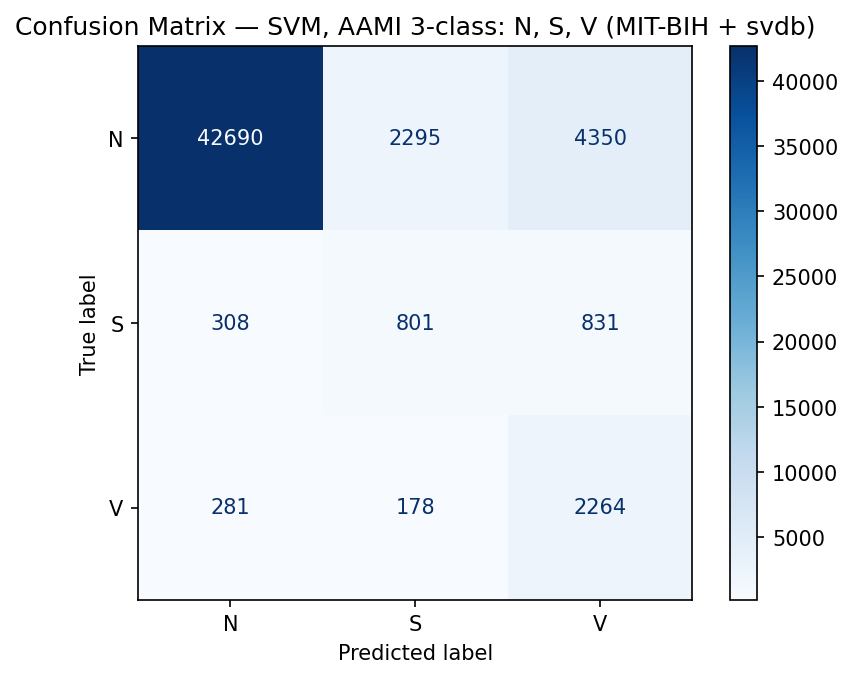

# ECG Heartbeat Classifier (SVM) — MIT-BIH, AAMI 3-Class

Classifying ECG heartbeats into the **AAMI EC57** classes **N / S / V** with a
**Support Vector Machine**, trained on the MIT-BIH Arrhythmia and MIT-BIH
Supraventricular Arrhythmia databases. KNN and Random Forest are included as
baselines for comparison.

This is the machine-learning core of my undergraduate graduation thesis.

**🔗 Related links**
- 🌐 **Full thesis website (live):** https://do-an-tot-nghiep-tuyen.netlify.app — all 4 chapters, with interactive ECG demos, formulas, and a hyperparameter-search walkthrough.
- 📂 **Website source:** https://github.com/BuiuyTuyen/ecg-thesis-site
- 🩺 The thesis also includes an **ESP32 + AD8232 hardware** system for live ECG acquisition (see Chapter 4 of the website).

---

## 1. Problem

An electrocardiogram (ECG) records the electrical activity of the heart as a
sequence of heartbeats. Some beats are normal; others are *arrhythmias* that a
cardiologist needs to catch. Reading long ECG recordings by hand is slow, so the
goal here is to **automatically label each heartbeat** from its waveform.

Following the **AAMI EC57** standard, every beat is grouped into one of three
clinically meaningful classes:

| Class | Meaning | Example annotations merged in |
|-------|---------|-------------------------------|
| **N** | Normal / bundle-branch beats | N, L, R, e, j |
| **S** | Supraventricular ectopic beat | S, A, a, J |
| **V** | Ventricular ectopic beat | V, E, F |

(Paced records 102, 104, 107, 217 are excluded, and unclassifiable `Q`/`f`
beats are dropped, per Chazal et al. 2004 and the AAMI recommendation.)

This is a **hard, imbalanced** problem: the abnormal S and V beats are rare, and
the model is evaluated on **patients it has never seen during training**.

## 2. Data

Two public databases from [PhysioNet](https://physionet.org/):

- **MIT-BIH Arrhythmia Database** (`mitdb`) — 44 records used (paced excluded), 360 Hz
- **MIT-BIH Supraventricular Arrhythmia Database** (`svdb`) — 78 records, resampled 128 → 360 Hz

After beat extraction (a ±0.25 s window around each R-peak):

| Source | N | S | V | Records |
|--------|----:|----:|----:|----:|
| MIT-BIH | 90,102 | 2,781 | 7,810 | 44 |
| svdb | 162,296 | 12,196 | 9,964 | 78 |
| **Combined** | **252,398** | **14,977** | **17,774** | **122** |

**285,149 beats total** — and ~88 % are class N, which is the core challenge
(severe class imbalance).

> The raw signal data is **not** included in this repo (it belongs to PhysioNet).
> The scripts download `svdb` automatically via `wfdb`; for `mitdb`, download it
> from PhysioNet and point `LOCAL_MITDB_PATH` (top of each script) to the folder.

## 3. Model

A classic, fully-interpretable ML pipeline (no deep learning):

```
ECG signal
  → R-peak window (±0.25 s)
  → 23 handcrafted features  (ecg_features.py)
  → StandardScaler
  → PCA (keep 95% variance)
  → SMOTE-ENN (balance rare S & V classes)
  → SVM (RBF kernel, class_weight="balanced", 5-fold GridSearchCV)
```

**23 features per beat** (single source of truth in `ecg_features.py`):
morphology (R/Q/S amplitudes, QRS width), statistics (mean, std, skew,
kurtosis, RMS), sub-band energy, signal area, zero-crossings, and **RR-interval
timing** (pre-RR, post-RR, RR ratio).

**Validation is patient-wise**: records are split 80/20 *before* feature
extraction, so no beat from a test patient is ever seen in training — this
avoids the optimistic leakage that inflates many ECG papers.

## 4. Results

Test set: **53,998 beats** from **25 unseen patients**.

| Model | Accuracy | Macro-F1 | Weighted-F1 |
|-------|:--------:|:--------:|:-----------:|
| SVM (RBF, C=10)      | 84.7 % | 0.558 | 0.876 |
| KNN (k=3)            | 84.5 % | 0.544 | 0.874 |
| **Random Forest**    | **91.5 %** | **0.631** | **0.922** |

Per-class F1 for the SVM:

| Class | Precision | Recall | F1 | Support |
|-------|:---------:|:------:|:--:|--------:|
| N | 0.986 | 0.865 | 0.922 | 49,335 |
| S | 0.245 | 0.413 | 0.307 |  1,940 |
| V | 0.304 | 0.831 | 0.445 |  2,723 |



**Takeaways**

- Normal beats are classified very reliably (F1 ≈ 0.92).
- The rare **S** and **V** classes are the bottleneck — expected under heavy
  imbalance and a strict patient-wise split. SMOTE-ENN + balanced class weights
  push recall up (the model *finds* most abnormal beats) at the cost of precision.
- **Random Forest** gave the strongest overall numbers; **SVM** and **KNN** are
  close and lighter to deploy. Single-beat SVM inference is **< 1 ms**, suitable
  for near-real-time use.

Full metrics (including timings and confusion matrices) are saved as JSON in
[`outputs/`](outputs/).

## 5. Repository layout

```
.
├── ecg_features.py   # shared 23-feature extractor (used by all 3 models)
├── SVM.py            # SVM pipeline — main model
├── RF.py             # Random Forest baseline
├── KNN.py            # KNN baseline
├── predict.py        # run a trained model on a new ECG record
├── count_beats.py    # tally beats per class across the databases
├── requirements.txt
└── outputs/          # trained SVM model + result JSONs + confusion matrices
```

## 6. Setup & usage

```bash
# 1. install dependencies (Python 3.10+)
pip install -r requirements.txt

# 2. point the scripts at your local MIT-BIH data
#    edit LOCAL_MITDB_PATH near the top of SVM.py / KNN.py / RF.py
#    (svdb downloads automatically on first run)

# 3. train + evaluate the SVM (writes model & metrics to ./outputs)
python SVM.py

# 4. predict on a new record using the trained model that ships in this repo
python -c "from predict import predict_record; \
print(predict_record('path/to/record', 'outputs/ecg_svm_3class_v5.pkl')[:5])"
```

`predict_record` runs the full inference path on a raw WFDB record (band-pass
filter → R-peak detection → 23 features → scaler → PCA → classifier) and returns
a label (and confidence) for every detected beat.

## 7. Notes & limitations

- The Random Forest model file (~416 MB) is **not** committed; retrain it with
  `python RF.py`. The smaller trained **SVM** model **is** included so `predict.py`
  works out of the box.
- Results come from a single patient-wise 80/20 split (seed 42); k-fold
  cross-patient validation would give tighter confidence intervals.
- Minority-class performance is the main avenue for improvement (e.g. richer
  features, threshold tuning, or sequence models).

## 8. Acknowledgements

- Moody GB, Mark RG. *The impact of the MIT-BIH Arrhythmia Database.* IEEE Eng in
  Med and Biol, 2001. Data via [PhysioNet](https://physionet.org/).
- de Chazal et al. *Automatic classification of heartbeats using ECG morphology
  and heartbeat interval features.* IEEE TBME, 2004.

## License

[MIT](LICENSE) — code only. The ECG databases are distributed by PhysioNet under
their own terms.
